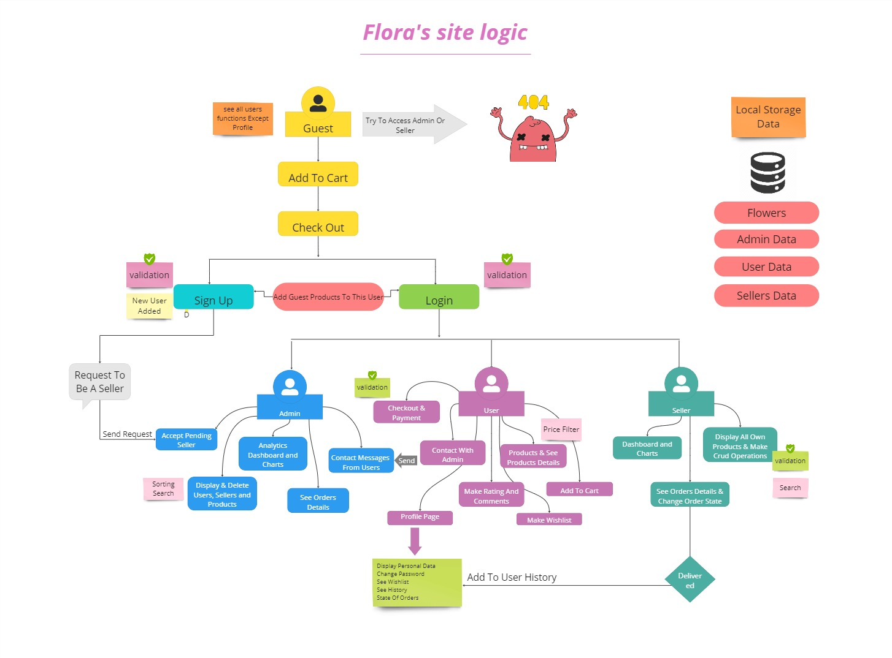

# Floura Flower E-Commerce Site 🌸

Welcome to Floura, your go-to destination for all things floral! This e-commerce platform is designed to provide a delightful shopping experience for flower enthusiasts. The project features three main user roles: Users, Admin, and Sellers. Each role has specific functionalities and access levels to ensure smooth operation.

<!---->

## Our Logic


## Features

- **Product Management**: Sellers can add, edit, and remove products. Users can view product details, add them to the cart, and explore the wide range of floral options.
- **User Profiles**: Users have personalized profiles to manage their information, view order history, and maintain a wishlist.
- **Shopping Cart**: Users can add products to their cart and proceed to checkout.
- **Admin Dashboard**: Admins have access to an admin dashboard to monitor and manage the overall system.
- **Order History**: Users can track their order history and view details of previous purchases.
- **Wishlist**: Users can add products to their wishlist for future reference.

## User Roles

### 1. User
- View and search for products.
- Add products to the shopping cart.
- View detailed product information.
- Manage user profile, including order history and wishlist.

### 2. Admin
- Access the admin dashboard.
- Monitor and manage product listings.
- View and manage user accounts.

### 3. Seller
- Manage own product listings.
- Monitor sales and order status.
- Update product information.

## Getting Started

### Prerequisites
1. Clone the repository.
   ```bash
   git clone https://github.com/asmaa-elfatayry/Flower-Shop-JS-Project.git
   cd floura-flower-ecommerce
   ```
2. Run index.html

  
## Usage

1. User
- Visit the Floura website.
- Browse through the floral collections.
- Click on a product to view details.
- Add desired products to the cart.
- Proceed to checkout and complete the order.
- Manage your profile, view order history, and maintain a wishlist.
  
2. Admin
- Control with all system.
- Monitor product listings and user accounts.


3. Seller
- Access the seller dashboard.
- Manage product listings, update information, and monitor sales.
- Ensure accurate and up-to-date product information.


Team Members:

GitHub-Username: [asmaa-elfatayry](https://github.com/asmaa-elfatayry)

GitHub-Username: [ahmed-fahmy17](https://github.com/ahmed-fahmy17)

GitHub-Username: [Eslam405](https://github.com/Eslam405)

GitHub-Username: [amira-mohamed-mahmoud](https://github.com/amira-mohamed-mahmoud)

GitHub-Username: [nayira411](https://github.com/nayira411)

Feel free to reach out with any questions or feedback. Happy shopping at Floura! 🌸
